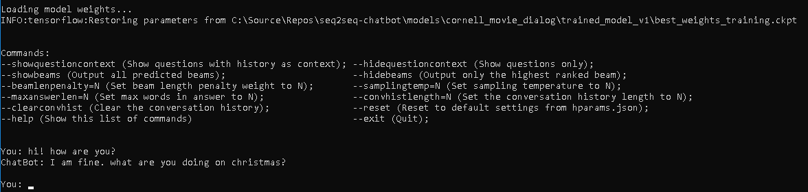
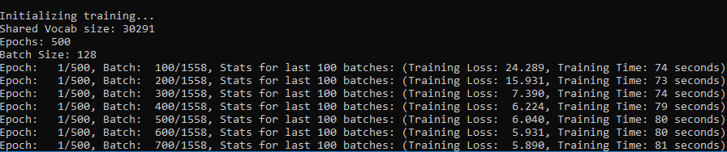
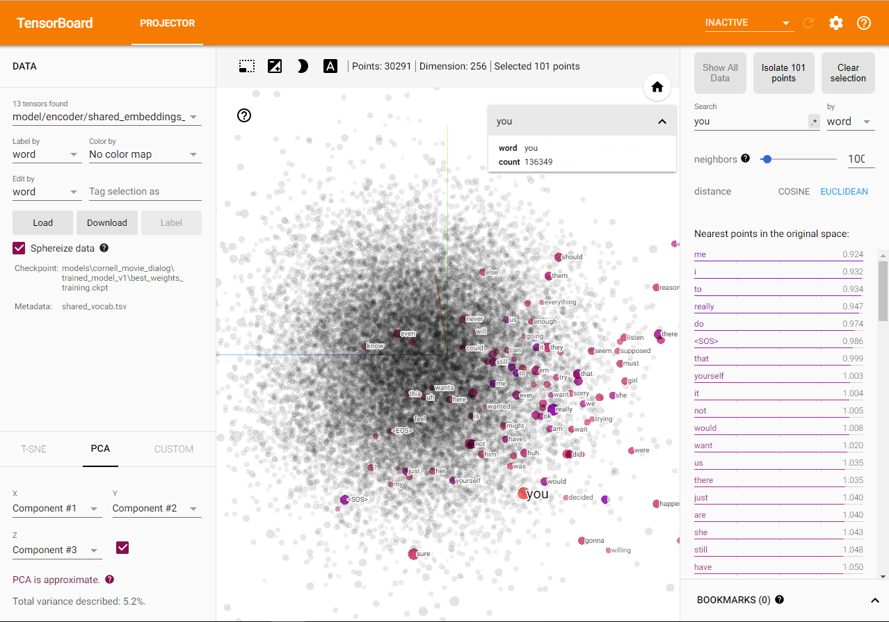

# seq2seq-chatbot
A sequence2sequence chatbot implementation with TensorFlow.

See instructions to get started below, or check out some [chat logs](seq2seq-chatbot/models/cornell_movie_dialog/trained_model_v2/chat_logs)

## Chatting with a trained model
### To chat with a trained model from the model directory:

(Batch files are only available for windows as of now. For mac and linux users see instructions below for python console.)

1. Make sure a model exists in the models directory (to get started, download and unzip [trained_model_v2](seq2seq-chatbot/models/cornell_movie_dialog/README.md) into the [seq2seq-chatbot/models/cornell_movie_dialog](seq2seq-chatbot/models/cornell_movie_dialog) folder)

For console chat:

2. From the model directory run `chat_console_best_weights_training.bat` or `chat_console_best_weights_validation.bat`

For web chat:

2. From the model directory run `chat_web_best_weights_training.bat` or `chat_web_best_weights_validation.bat`

3. Open a browser to the URL indicated by the server console, followed by `/chat_ui.html`. This is typically: [http://localhost:8080/chat_ui.html](http://localhost:8080/chat_ui.html)

### To chat with a trained model from a python console:

1. Set console working directory to the **seq2seq-chatbot** directory. This directory should have the **models** and **datasets** directories directly within it.

2. Run chat.py with the model checkpoint path:
```shell
run chat.py models\dataset_name\model_name\checkpoint.ckpt
```

For example, to chat with the trained cornell movie dialog model **trained_model_v2**:

1. Download and unzip [trained_model_v2](seq2seq-chatbot/models/cornell_movie_dialog/README.md) into the [seq2seq-chatbot/models/cornell_movie_dialog](seq2seq-chatbot/models/cornell_movie_dialog) folder

2. Set console working directory to the **seq2seq-chatbot** directory

3. Run:
```shell
run chat.py models\cornell_movie_dialog\trained_model_v2\best_weights_training.ckpt
```

The result should look like this:



## Training a model
To train a model from a python console:

1. Configure the [hparams.json](seq2seq-chatbot/hparams.json) file to the desired training hyperparameters

2. Set console working directory to the **seq2seq-chatbot** directory. This directory should have the **models** and **datasets** directories directly within it.

3. To train a new model, run train.py with the dataset path:
```shell
run train.py --datasetdir=datasets\dataset_name
```

Or to resume training an existing model, run train.py with the model checkpoint path:
```shell
run train.py --checkpointfile=models\dataset_name\model_name\checkpoint.ckpt
```

For example, to train a new model on the cornell movie dialog dataset with default hyperparameters:

1. Set console working directory to the **seq2seq-chatbot** directory

2. Run:
```shell
run train.py --datasetdir=datasets\cornell_movie_dialog
```

The result should look like this:



### Transfer learning with pre-trained embeddings:
Docs coming soon...

## Visualizing a model in TensorBoard
[TensorBoard](https://www.tensorflow.org/programmers_guide/summaries_and_tensorboard) is a great tool for visualizing what is going on under the hood when a TensorFlow model is being trained.

To start TensorBoard from a terminal:
```shell
tensorboard --logdir=model_dir
```

Where model_dir is the path to the directory where the model checkpoint file is. For example, to view the trained cornell movie dialog model **trained_model_v2**:
```shell
tensorboard --logdir=models\cornell_movie_dialog\trained_model_v2
```

### Visualize Training
Docs coming soon...

### Visualize model graph
Docs coming soon...

### Visualize word embeddings
TensorBoard can project the word embeddings into 3D space by performing a dimensionality reduction technique like PCA or T-SNE, and can allow you to explore how your model has grouped together the words in your vocabulary by viewing nearest neighbors in the embedding space for any word.
More about word embeddings in TensorFlow and the TensorBoard projector can be found [here](https://www.tensorflow.org/programmers_guide/embedding).

When launching TensorBoard for a model directory and selecting the "Projector" tab, it should look like this:


## Adding a new dataset
Instructions coming soon...

## Dependencies
The following python packages are used in seq2seq-chatbot:
(excluding packages that come with Anaconda)

- [TensorFlow](https://www.tensorflow.org/) *Note - TF 2.x is not yet supported, use the latest TF 1.x version.
    ```shell
    pip install --upgrade tensorflow==1.*
    ```
    For GPU support: [(See here for full GPU install instructions including CUDA and cuDNN)](https://www.tensorflow.org/install/)
    ```shell
    pip install --upgrade tensorflow-gpu==1.*
    ```

- [jsonpickle](https://jsonpickle.github.io/)
    ```shell
    pip install --upgrade jsonpickle
    ```

- [click 6.7](https://palletsprojects.com/p/click/), [flask 0.12.4](http://flask.pocoo.org/) and [flask-restful](https://flask-restful.readthedocs.io/en/latest/) (required to run the web interface)
    ```shell
    pip install click==6.7
    pip install flask==0.12.4
    pip install --upgrade flask-restful
    ```

## Roadmap
See the [Roadmap Page](doc_files/roadmap.md)
  
## Acknowledgements
This implementation was inspired by:
- Kirill Eremenko & Hadelin de Ponteves [Deep NLP Udemy course](https://www.udemy.com/chatbot/)
- TensorFlow's [Neural Machine Translation (seq2seq) Tutorial](https://www.tensorflow.org/tutorials/seq2seq)
  - [TF NMT GitHub](https://github.com/tensorflow/nmt)
  
## Relevant papers
1. [Sequence to Sequence Learning with Neural Networks](https://arxiv.org/abs/1409.3215)

2. [A Neural Conversational Model](https://arxiv.org/abs/1506.05869)

3. [Neural Machine Translation by Jointly Learning to Align and Translate](https://arxiv.org/abs/1409.0473) (Bahdanau attention mechanism)

4. [Effective Approaches to Attention-based Neural Machine Translation](https://arxiv.org/abs/1508.04025) (Luong attention mechanism)
